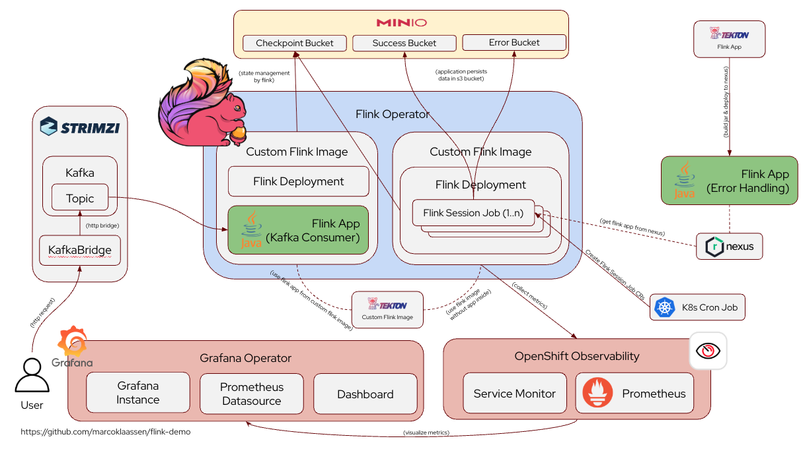
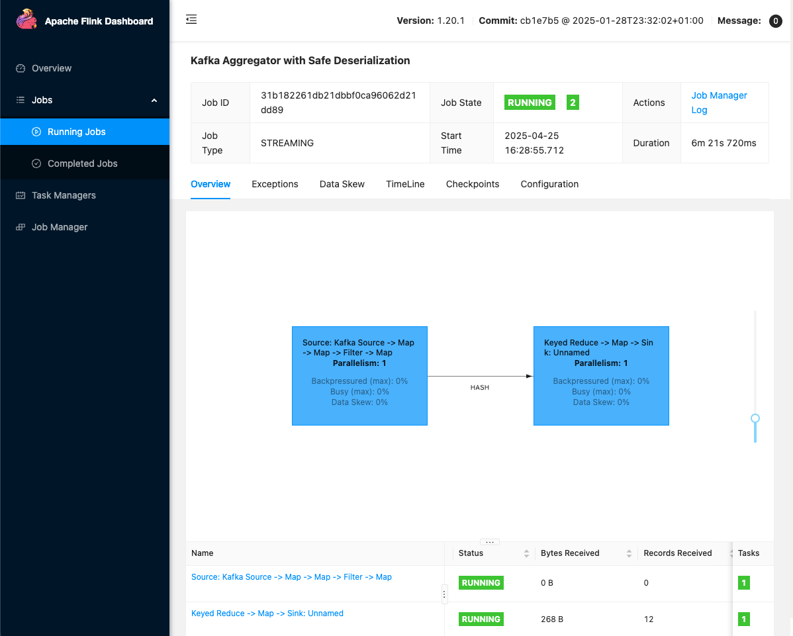
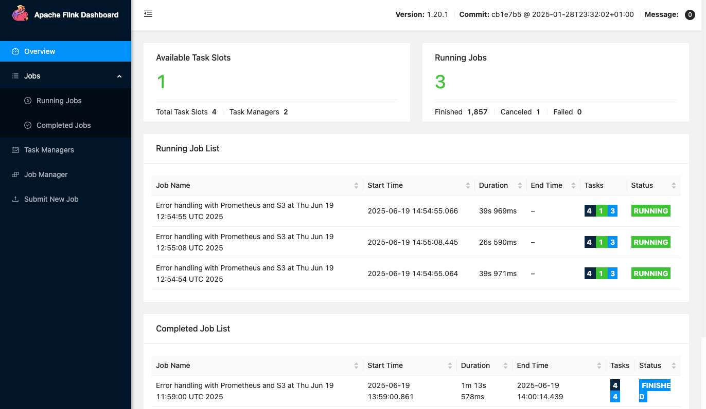
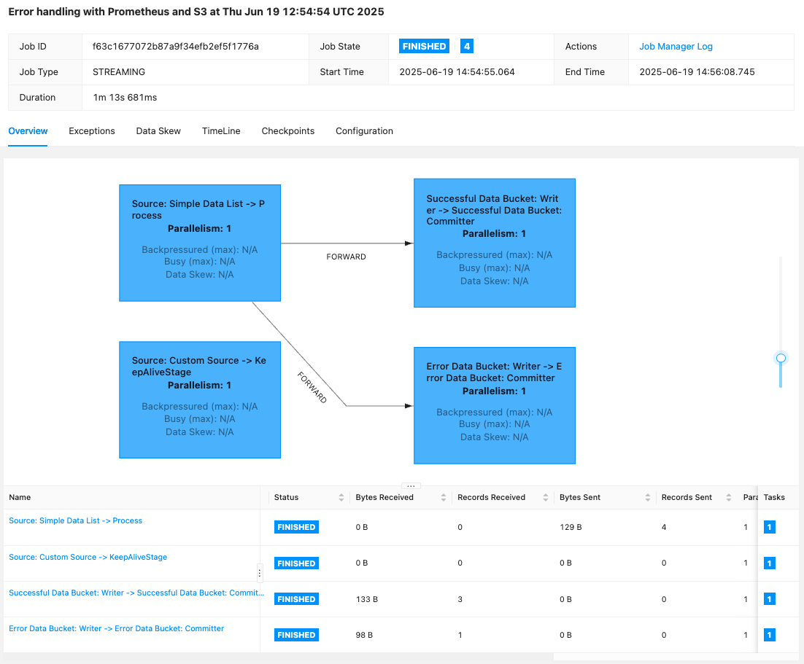
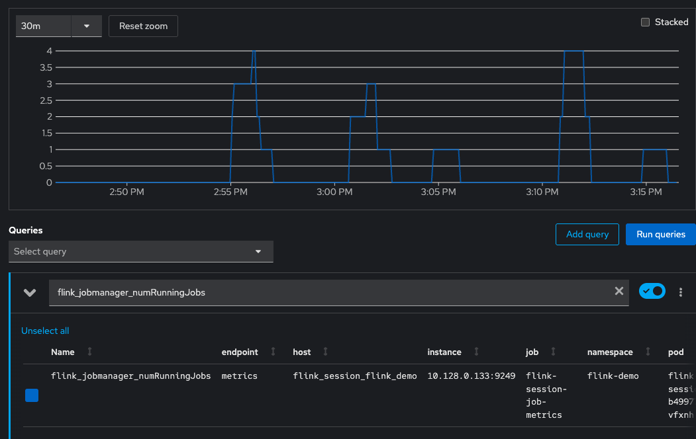
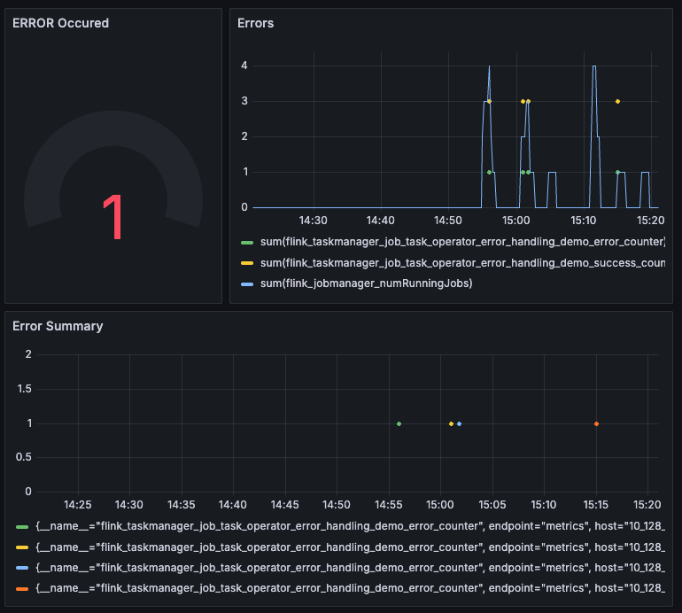

# Flink Demo

This is an Apache Flink Demo which shows how to configure and operate Apache Flink on an OpenShift cluster and [how to handle data streaming](flink-aggregator-app/README.md) and [batch processing with error handling and observability](flink-error-handling/README.md). 

It covers use cases like: 
1. continues streaming of data from a kafka topic
1. sink based error handling 
1. metrics based error handling
1. local development with flink applications
1. setup and configure an OpenShift namespace
1. setup OpenShift user workload observability and let flink apps produce metrics
1. setup a grafana instance and implement a grafana dashboard for error handling of flink apps
1. setup a Minio instance to store the checkpoints, savepoints and the data which was processed by the flink app
1. setup a nexus instance to manage the flink apps 
1. configure tekton piplines to implement a fully automated CI/CD pipeline for the entire flink application and infrastructure
1. setup and configure a strimzi kafka instance and a kafka bridge to produce events to the kafka topic via HTTP requests 


## Table of content

- [Flink Demo](#flink-demo)
  - [Table of content](#table-of-content)
  - [Demo Architecture](#demo-architecture)
  - [Prerequisites](#prerequisites)
  - [Installation and Configuration](#installation-and-configuration)
    - [Installation of supporting components on OpenShift](#installation-of-supporting-components-on-openshift)
    - [Configure Minio](#configure-minio)
      - [UI based](#ui-based)
      - [CLI based](#cli-based)
    - [Install Flink components on OpenShift](#install-flink-components-on-openshift)
    - [Configure Nexus server](#configure-nexus-server)
    - [Build and Deploy Flink applications](#build-and-deploy-flink-applications)
  - [Play around with the demo](#play-around-with-the-demo)
    - [Flink Kafka Consumer Demo](#flink-kafka-consumer-demo)
    - [Flink Error Handling Demo](#flink-error-handling-demo)
      - [Create new Flink Session Job](#create-new-flink-session-job)
      - [Monitoring in general](#monitoring-in-general)
      - [Metrics](#metrics)
  - [Links \& Resources](#links--resources)

## Demo Architecture




## Prerequisites

* Up and Running OpenShift Cluster
* Streams for Apache Kafka operator installed
* Flink Kubernetes Operator installed
* Red Hat OpenShift Pipelines operator installed
* OpenJDK 17 installed and configured
* mvn installed and configured
* Tekton CLI installed (`brew install tektoncd-cli`)
* Nexus Repository Operator operator installed
* Grafana Operator installed 

## Installation and Configuration

### Installation of supporting components on OpenShift

* create a new project `flink` with `oc new-project flink-demo`
* apply the manifests for 
  * minio (to manage s3 buckets for success / error data sinks and the flink state)
  * strimzi for kafka instance and the kafka bridge to be able to produce new messages via http
  * tekton pipeline to build the java application and the custom flink base image
  * nexus server to manage the jar artifact
  * grafana to setup the grafana instance, the prometheus datasource and the dashboard

```
oc apply -f minio
oc apply -f strimzi
oc apply -f tekton/pipeline
oc apply -f nexus
oc apply -f grafana
```

### Configure Minio

#### UI based
There are some buckets which are expected by the flink deployments. 
To create this buckets:

* Login to minio web-ui: `https://minio-flink-demo.apps.<your-host>/` with the default credentials
* create three buckets `flink-data-checkpoints`, `flink-data-savepoints` & `flink-error-handling` via the minio web-ui


#### CLI based
If you are more familiar with the minio cli tool, you can of course use this one. 

Install & Configure Minio CLI: 

```
brew install minio/stable/mc
mc alias set local https://minio-api-flink-demo.apps.<your-host>/ <user> <password>
```

**Note:** The S3 API endpoint uses a different route (`minio-api-flink-demo`) than the web UI (`minio-flink-demo`). The S3 API route exposes port 9000, which is required for the MinIO CLI to work properly.

Create bucket in minio:

```
mc mb local/flink-error-handling
mc mb local/flink-data-savepoints
mc mb local/flink-data-checkpoints
```

### Install Flink components on OpenShift

Apply the manifests for the flink deployment and it's infrastructure

```
oc apply -f flink/infrastructure
oc apply -f flink/custom-resources
oc apply -f flink/metrics
```

In the infrastructure directory there is everything included you need to start a flink deployment and access the flink dashboard. 

In the custom resources directory there are the flink deployment manifests which deploy two flink job managers to your cluster. 

The metrics part is responsible to configure user workload monitoring on OpenShift and the service monitor to get the metrics. 

### Configure Nexus server

**Get the default admin password:**

The default admin username is `admin`. The Nexus Repository Operator automatically sets the initial admin password in the pod's environment variable `NEXUS_SECURITY_INITIAL_PASSWORD`. To retrieve it:

```bash
# Find the Nexus pod name
NEXUS_POD=$(oc get pods -n flink-demo -l app=nxrm -o name | head -1 | sed 's/pod\///')

# Get the admin password from the environment variable
oc exec -n flink-demo $NEXUS_POD -- env | grep NEXUS_SECURITY_INITIAL_PASSWORD
```

**Note:** After first login, Nexus will prompt you to change the password. It's highly recommended to do so.

* create `flink` repository in nexus instance (`https://nexus-flink-demo.apps.<your-host>/`)
  * create new repository from type `maven2 (hosted)`
  * name should be `flink`
  * version policy: `release`
  * deployment policy: `Allow redeploy`
* configure anonymous access to flink repo in nexus to avoid more complexity in the pipeline for this demo. In production environments it's highly recommended to implement proper security concepts.
  * in this demo use case I simply add `nx-admin` role to user `anonymous` (not recommended for production environments)


### Build and Deploy Flink applications

In this demo there are two Flink applications: 

* [Flink Error Handling](flink-error-handling/README.md)
* [Flink Aggregator App](flink-aggregator-app/README.md)

To use this demo it's mandatory to build and deploy this applications. 
You can use the already deployed tekton pipelines to build and deploy both applications. 

More information on how to build and deploy the applications can be found in the READMEs of the applications. 

## Play around with the demo

### Flink Kafka Consumer Demo 

In this part of the demo a new message will be produced on a kafka topic. The flink aggregator app consumes the message and aggregates the `total` property of the message.

* execute the curl command to `POST` new events to the topic

```
curl -i -X POST https://kafka-bridge-flink-demo.apps.<your-host>/topics/flink \
  -H "Content-Type: application/vnd.kafka.json.v2+json" \
  -d '{
        "records": [
          { "value": { "user": "Marco", "counter": "2" } }
        ]
      }'
```

* have a look to the `flink-aggregator-taskmanager` pod's logs and you'll see the aggregation of the events

```
oc logs -f $(oc get pods -l app=flink-aggregator -l component=taskmanager --field-selector='status.phase=Running' -o name) | grep click.klaassen.flink
```

Example output: 

```
<date> INFO  click.klaassen.flink.HttpSink [] - Sending aggregated Request: {"user":"Marco","total":8}
```

Access the Flink Dashboard (`https://flink-aggregator-flink-demo.apps.<your-host>`) to get an overview. 


### Flink Error Handling Demo

This demo handles errors in data processing and represents a cron job. 
 
#### Create new Flink Session Job

Creating a new Flink Session Job custom resource executes a new job:

```
oc create -f flink/session-job/flink-error-handling-job.yaml
```

You can also submit new Jobs via the Flink Dashboard (`https://flink-session-flink-demo.apps.<your-host>/#/submit`) by uploading a JAR file. 


If you would like to setup a cron job which executes the job recurrent apply this K8s cron job (and a service account with permission to create CRs): 

```
oc apply -f flink/cron-job
```

#### Monitoring in general

The first indicator to observe the state of the job is to have a look at the status property at the custom resource itself: 

```
oc get flinksessionjobs.flink.apache.org \
  --sort-by=.metadata.creationTimestamp \
  -o json | jq '.items[-1].status'
```

This is an example of a sucessfully finished job: 

```
{
  "jobStatus": {
    "checkpointInfo": {
      "lastPeriodicCheckpointTimestamp": 0
    },
    "jobId": "71738e12120b93872bbab8a69cfdb26b",
    "jobName": "Error handling with Prometheus and S3 at Thu Jun 19 12:55:08 UTC 2025",
    "savepointInfo": {
      "lastPeriodicSavepointTimestamp": 0,
      "savepointHistory": []
    },
    "startTime": "1750337708445",
    "state": "FINISHED",
    "updateTime": "1750337785600",
    "upgradeSavepointPath": "s3a://flink-data-checkpoints/checkpoints/71738e12120b93872bbab8a69cfdb26b/chk-13"
  },
  [...]
}
```

You can also have a look at the Flink Dashboard (`https://flink-session-flink-demo.apps.<your-host>/#/overview`) where you can see all running and already completed jobs: 



If you would like to have a deeper look into the job check the job overview page. 
There you can find the different tasks and a diagram of the dataflow. You also get information about which element sent and received how many messages. This is also a great indicator of monitoring the execution state. 



#### Metrics

To have an extended method to monitor job executions Flink supports providing default and application specific metrics. 
The error handling application produces two customer metrics. 
A success- and an error counter. 
Together with the default metrics of Jobmanager and Taskmanager in Flink we get a lot of information about our environment. 

In this demo we use the workload user monitoring from the OpenShift cluster which allows us to store the provided metrics by flink in a prometheus instance without any further configuration. We just have to enable the user workload monitoring via a config map and apply a service monitor for our metrics entpoint the the taskmanager and the jobmanager. 

In this state we are already able to observe our Flink environment in the built-in OpenShift Prometheus UI: `https://console-openshift-console.apps.<your-host>/monitoring/query-browser?query0=flink_jobmanager_numRunningJobs`

With this url you'll be redirected direcly to a dashboard where you can find the number of running jobs in the history. 



But to build end-user compatible and easy accessible dashboards we have a simple Grafana Dashboard set up. 
This dashboard (`https://grafana-flink-demo.apps.<your-host>/d/aeou10nstrxmoc/flink-dashboard?from=now-1h&to=now&timezone=browser`) has 3 elements: 

1. The `ERROR Occured` indicator which is `1` and red when an error occured in one of the jobs.
1. The `Errors` panel which combines the 
   - number of running jobs
   - error counter
   - success counter
1. The `Error Summary` to have a more detailed look at the errors with information about
   - when the error occured
   - in which job 
   - which task id 
   - ...



## Links & Resources

* https://nightlies.apache.org/flink/flink-docs-master/
* https://nightlies.apache.org/flink/flink-docs-master/docs/deployment/resource-providers/native_kubernetes/
* https://min.io/docs/minio/kubernetes/upstream/index.html
* https://docs.redhat.com/en/documentation/openshift_container_platform/4.18
* https://developers.redhat.com/articles/2023/08/08/how-monitor-workloads-using-openshift-monitoring-stack#how_to_monitor_a_sample_application
